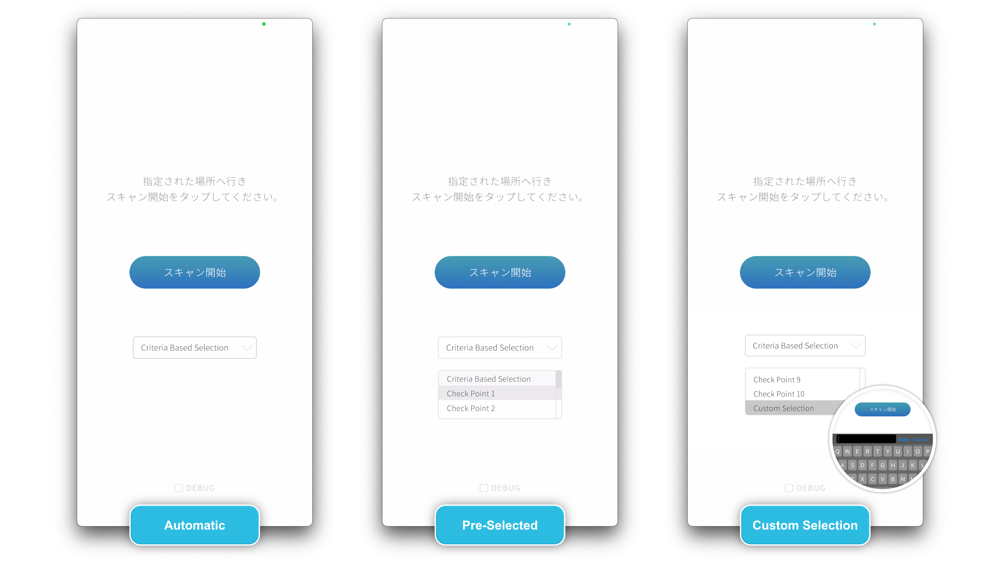
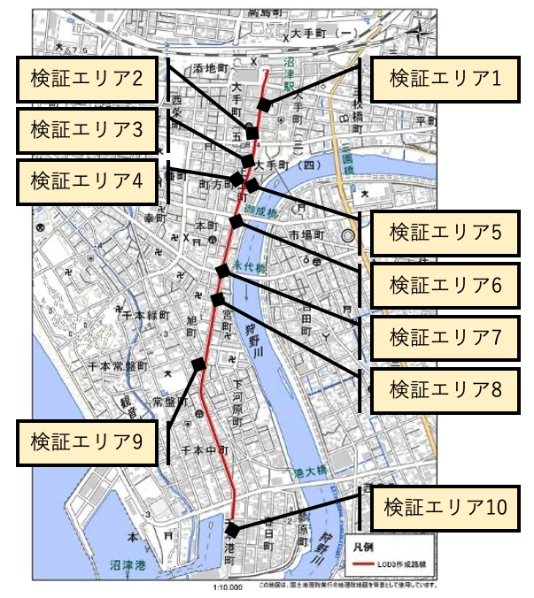
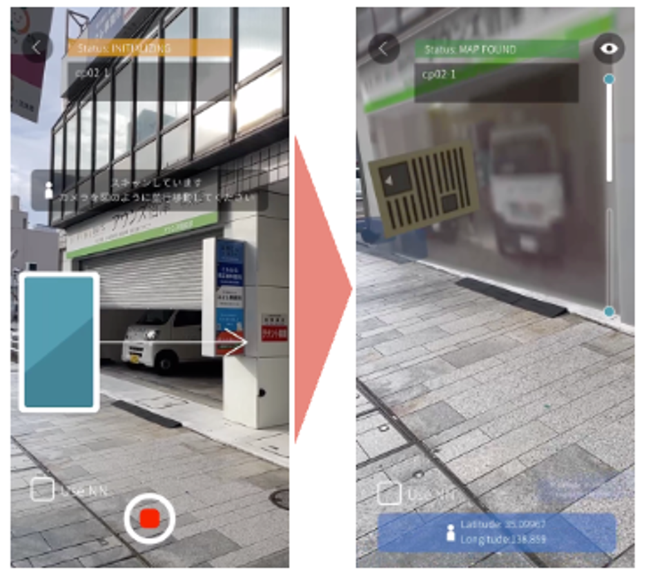
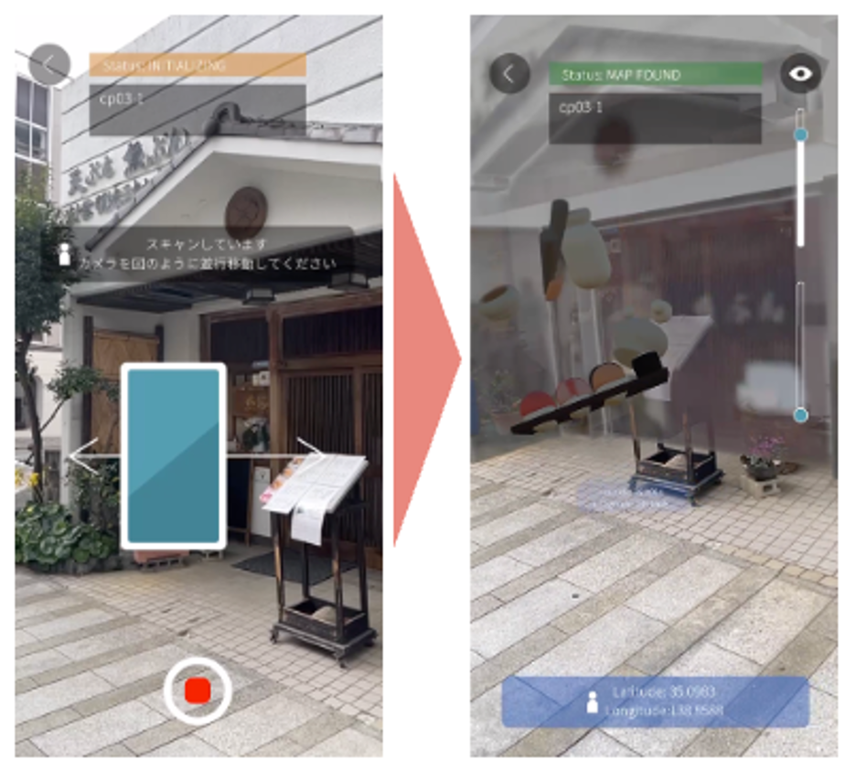
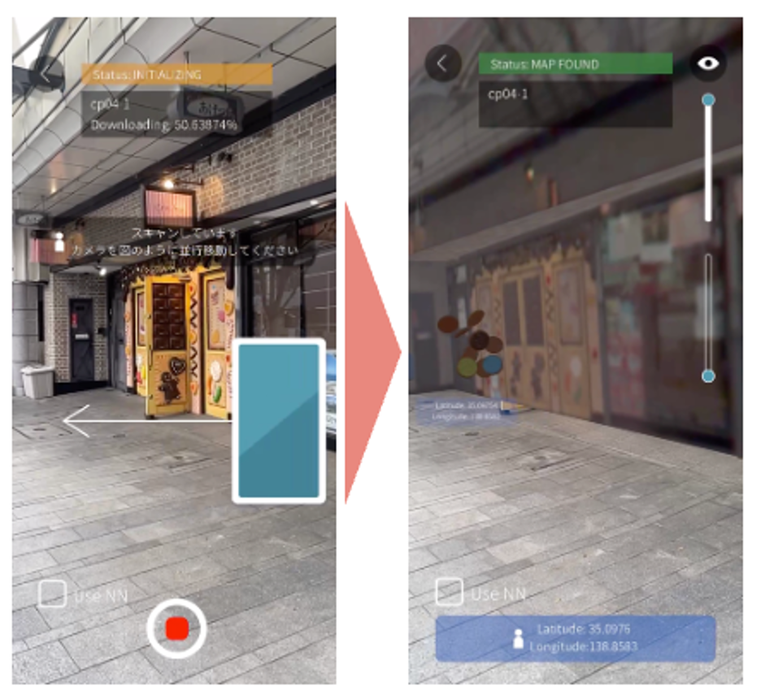
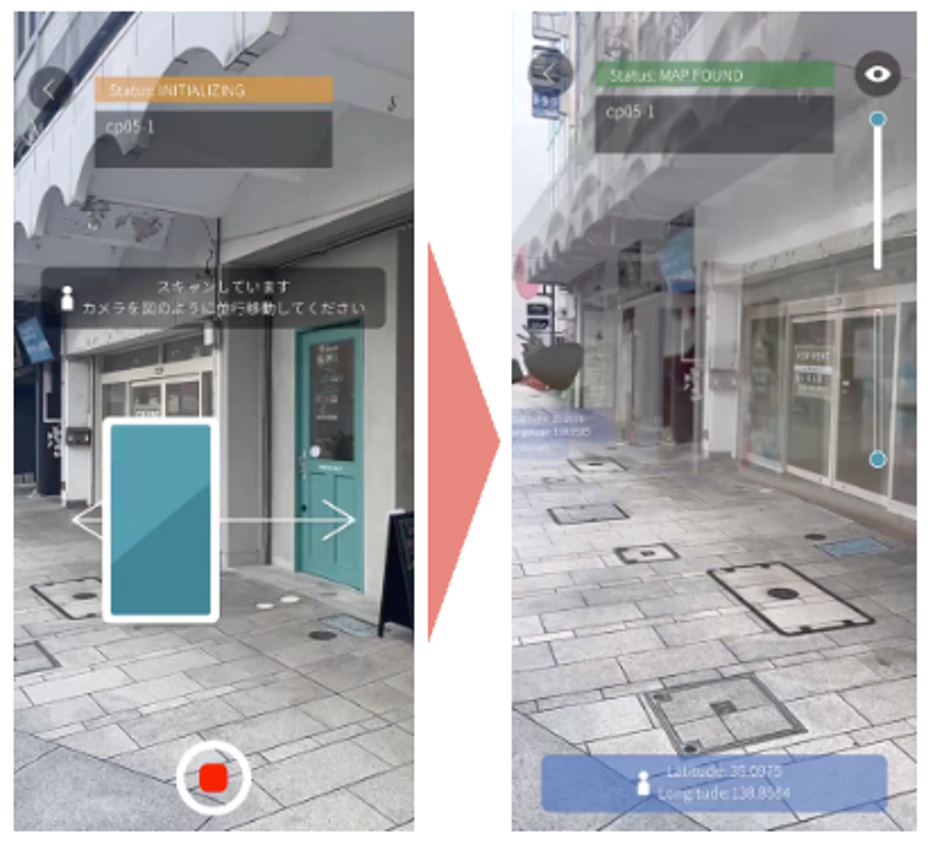
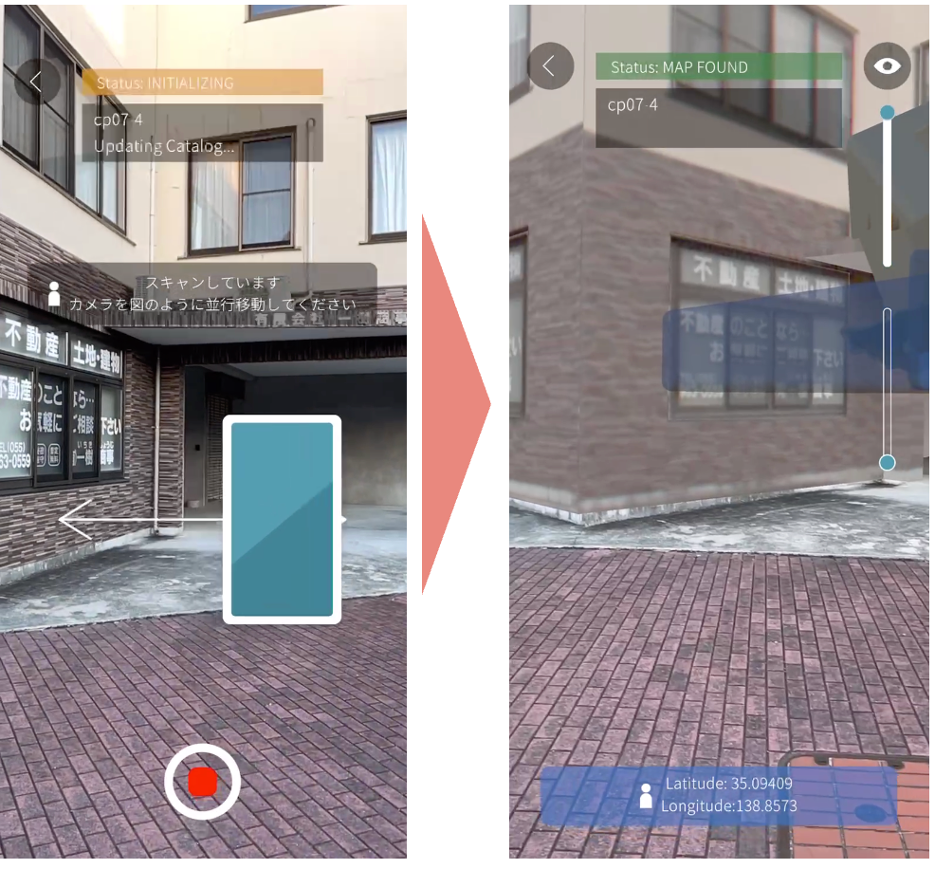
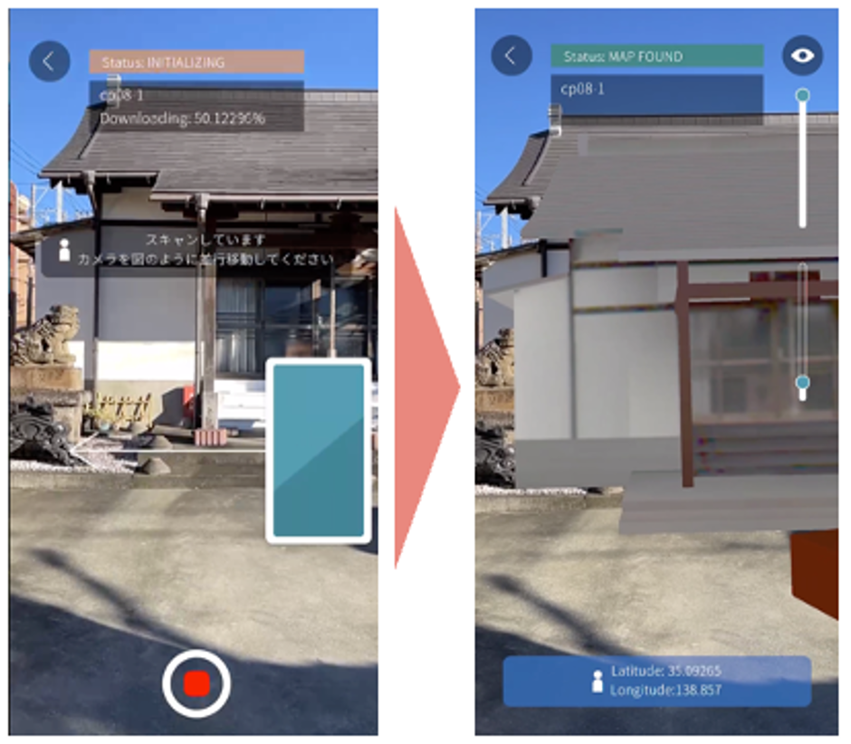
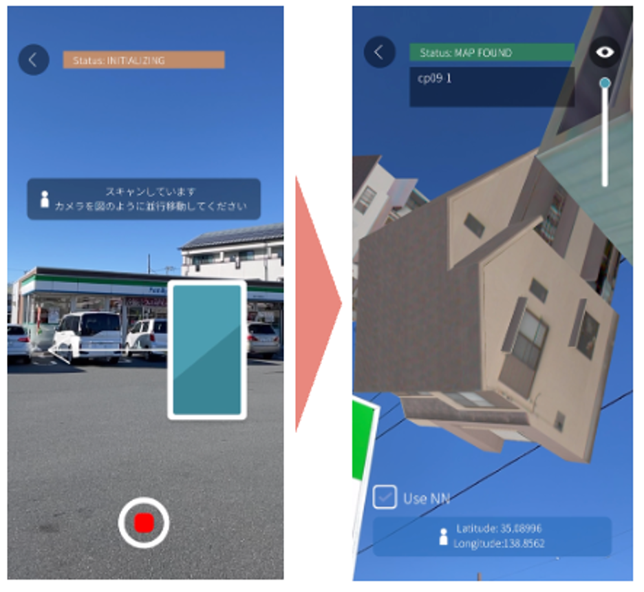
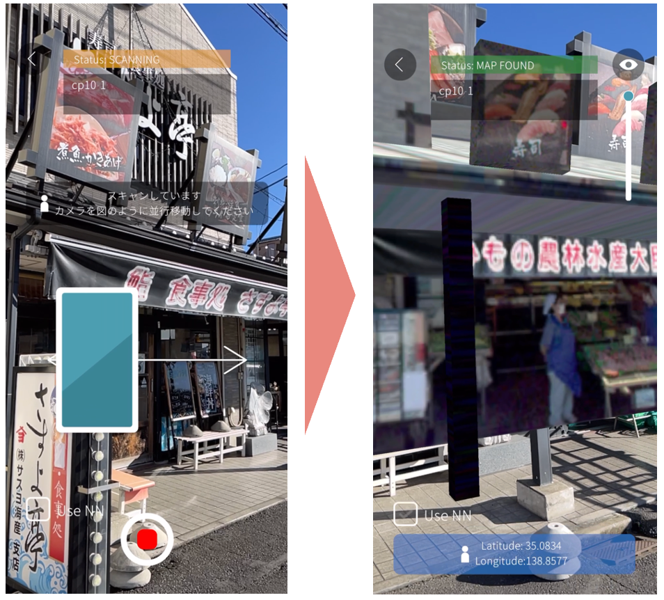

# 操作マニュアル

# 1 本書について

本書では、3D都市モデルに最適化したVPS（以下「本システム」という。）の操作手順について記載しています。

# 2 使い方

## 2-1 メイン画面

iPhoneにてアプリを起動するとメイン画面が表示されます。

スキャンを開始するには、まず、メインメニューのドロップダウンメニューから以下のオプションのいずれかを選択してください。選択後「スキャン開始」ボタンを押下することでスキャン画面へ遷移します。

- Criteria-based Location: このオプションは、GPSを利用して現在地から最も近い地図を自動的に検出します。

- Checkpoint Selection: ここでは、1 から 10 までの番号の、あらかじめ組み込まれたオプションのリストから選択できます。地図同士が近すぎる場合など、GPS精度の問題でCriteria-based Locationによるマップの自動選択ができない場合に、この機能を使用して手動で地図を選択します。

- Custom Map Key: 開発者向けにカスタマイズされたロケーションを利用する場合のオプションです。

## 2-2 スキャン画面

- チェックポイントへ移動: 本プロジェクトで指定する沼津市のチェックポイントへ移動してください。

- カメラビューの起動: アプリで「スキャン開始」ボタンをタップし、カメラビューを起動してください。

- カメラを対象の建物に向け静止する: 端末のカメラをチェックポイントの指定された建物に向けて静止してください。

- スキャンの開始: 画面上の丸い赤いボタンを押してスキャンを開始します。

- スキャンの実行: 正確なスキャンのために、建物をカメラのフレーム内に収めることを確認しながら、静止します。数秒経っても画面が遷移しない場合左から右へ、ゆっくりと携帯電話を水平に動かし、再度静止します。

- スキャンの完了 (Reloc) プロセス: スキャン（Reloc）が完了すると、拡張現実（AR）コンテンツが表示される。

(参考)検証エリア

| エリア No | エリア名 | 表示イメージ |
|-|-|-|
| 1 | ケーキショップ Dolce周辺         |  |
| 2 | くわはら矯正歯科医院周辺     |   |
| 3 | 魚ぶん周辺     |   |
| 4 | デザートレストラン Grandma 上土本店周辺     |   |
| 5 | 美容室　GUK周辺     |   |
| 6 | サンフロント静岡新聞ＳＢＳ静岡放送東部総局ビル周辺     |   |
| 7 | （有）一樹商事周辺     |   |
| 8 | 不動院周辺     |   |
| 9 | ファミリーマート 沼津下河原町店周辺     |   |
| 10 | （有）するが水産周辺     |   |

